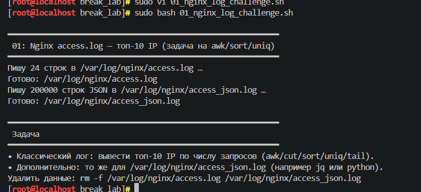
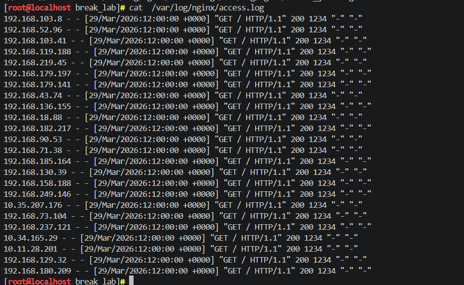
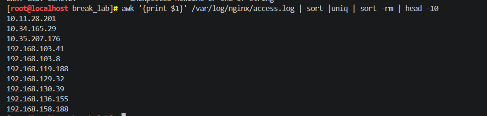
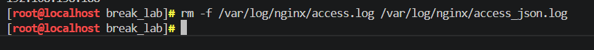

## BREAK лабораторные

## Лаба 1 с использованием скрипта 01_nginx_log_challenge

---

Для выполнения лабораторной я развернула виртуальную машину с редос сервер минимальный. 
Скрипт 01_nginx_log_challenge создает тестовые логи веб-сервера. Он сгенерировал миллион записей в файл /var/log/nginx/access.log,а это стандартный журнал, куда Nginx записывает информацию о каждом обращении к серверу. Такие логи нужны, чтобы чекать кто че как делает и шалит у нас на сайте: какие страницы открывает, сколько данных передает. Ну и в целом чтоб понимать, что происходит с сервером.

После запуска скрипта (скриншот 1) генерируется много записей, которые занимают место на диске. Если места диска мало (жиза), система может начать работать медленно или даже перестать пускать пользователей.

Я сначала посмотрела содержимое файла, чтобы понять его структуру, хотя по заданию после генерации логов нужно было вывести десять IP-адресов, которые встречаются чаще всего. 

В общем в (скриншот 2) в каждой строке первым идет айпишник, потом остальные данные через пробелы. Для вывода 10 айпи нужно  собрала команду довольно большую , но по логике понятную команду, которая делает следующее: берет первый столбец из каждой строки, группирует одинаковые адреса, убирает повторы и выводит первые десять записей. 

awk  вырезает нужное поле, sort упорядочивает список, uniq оставляет только уникальные значения, а head показывает указанное количество строк. (скриншот 3)

После того как я получила результат, нужно было очистить сгенерированные файлы. Я удалила оба лога используя команду которую увидела после запуска скрипта, ну как подсказка (скриншот 4)

## Результаты выполнения

**запуск скрипта 1:**

**содержимое файла:**

**вывод 10 айпишников:**

**удаление сгенер файлов:**

 
p.s я маскильно не внимательная и на автомате в первой лабе писала везде sudo хоть и была под рутом гспд 