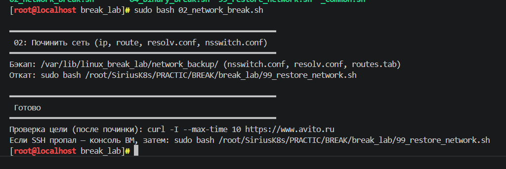
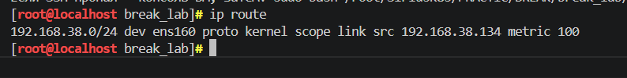
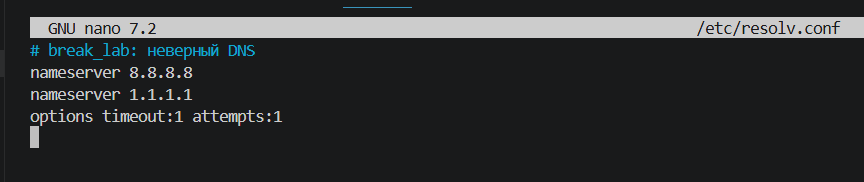
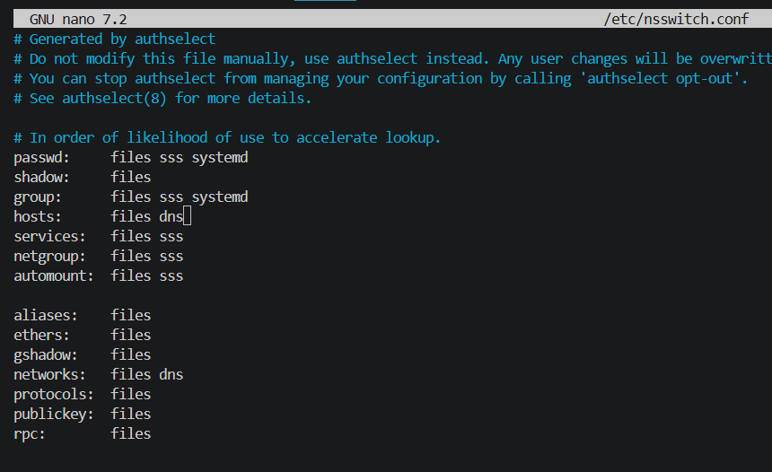
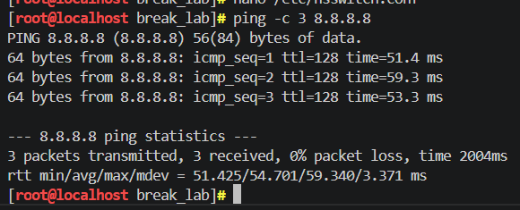
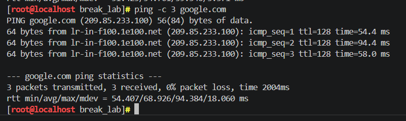
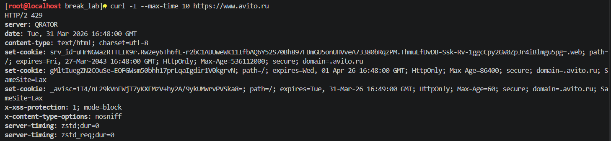

## BREAK лабораторные

## Лаба 2 с использованием скрипта 02_network_break.sh

---
Скрипт 2 намеренно ломает сетевые настройки, поэтому цель лабы научиться восстанавливать все вручную. 
Сначала я запустила скрипт (скриншот 1),после этого пинг перестал проходить тк всё сломалось как надо 

Дальше я начала разбираться, что именно случилось и что сломалось. Посмотрела таблицу маршрутизации (скриншот 2) и увидела, что там есть только локальная сеть, но нет строки default via. ну эта ошибка которая значит, что система не знает, через какой шлюз отправлять пакеты этого маршрута, поэтому и интернета нету

ДЛя решения проблема нужно просто врунчую добавить адрес шлюза. Командой ip route add default via 192.168.38.2 dev ens160  вернула маршрут по умолчанию. Незнаю что тут подробно рассказывать и объяснять все понятно.

Потом посмотрела содержимое файла, который отвечает за DNS-сервера. Внутри вместо нормального адреса была какая-то фигня. Я исправила его прописав публичные адреса Google и Cloudflare. Теперь система знает куда обращаться, чтобы преобразовывать доменные имена в  айпи адреса. (скриншот 3)

Ещё я проверила файл /etc/nsswitch.conf. В нём есть строка hosts:, которая определяет откуда система берет информацию о хостах. Если там написано только files, то DNS не будет использоваться вообще, что следовательно у меня и было. Поэтому я просто дописала часть которой не хватало и сохранила изменения (скриншотик 4)

После всех исправлений я проверила, всё ли работает. Сначала пропинговала по адресу 8.8.8.8 (скриншот 5), ну вот пакеты пошли, значит, связь с внешним миром есть. Потом пропинговала тот же гугл но через доменное имя google.com, которое успешно преобразовалось, и пинги тоже прошли. Значит, DNS тоже работает. (скриншот 6)

Последняя проверка по заданию запрос к сайту avito.ru через curl. Сайт ответил, значит я полностью починила интернетик (сркиншот 7). Всё починила вручную, без использования скрипта отката, я отвечаю 

может возникнуть вопрос по поводу использования редактора nano, а не vim, но я и во время пары и дома потренировалась пользоваться vim (ещё использовались как-то на других парах не помню где). Вроде нигде не было написано, что нужно использовать именно его поэтому в лабе использую привычный и любимый nano
## Результаты выполнения

**запуск скрипта 2:**

**таблица маршрутизации:**

**редактирование файла DNS:**

**редактирование файла nsswitch.conf:**

**проверка по ip адресу:**

**проверка по доменному имени:**

**Проверка по заданию:**

