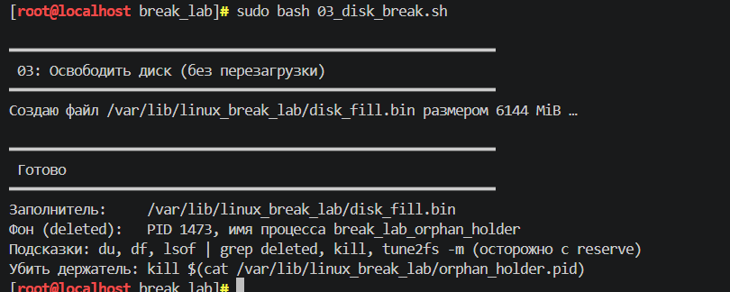
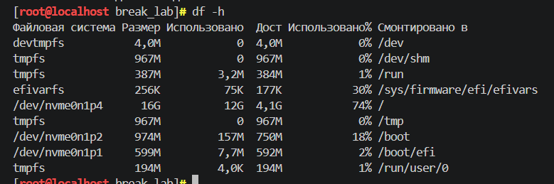
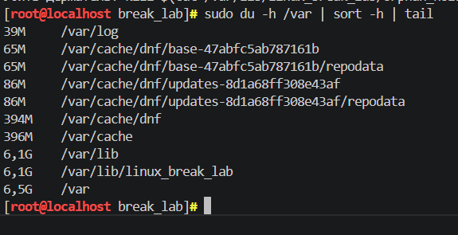
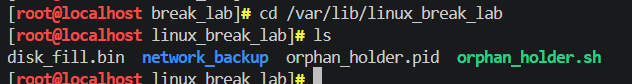
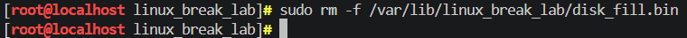
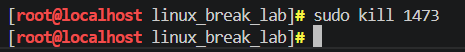
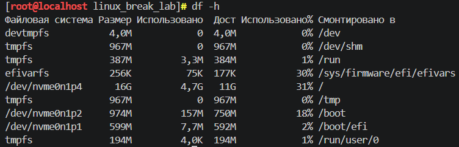

## BREAK лабораторные

## Лаба 3 с использованием скрипта 03_disk_break.sh

---
В 3 лабе нужно было разобраться с ситуацией, когда диск заполняется большим файлом, а нам надо восстановить свободное место без перезагрузки системы.

Я запустила скрипт (скриншот 1), который создал проблему , если точнее он создал файл размером 6 ГБ и дополнительно запустил процесс, который удерживал этот файл в открытом состоянии. Я думаю этот момент важно понимать, потому что пока линукс запрашивает файл (процесс), данные на нем нельзя стиреть.

После скрипта я проверила состояние дисков с помощью (скриншот 2). В корневом разделе использовалось 12 ГБ из 16 ГБ, то есть загруженность была около 74%. Нужно понять чем именно занято место, это можно сделать посмотрев каталог /var командой (скриншот 3). Ну вот в выводе увидела, что папка /var/lib/linux_break_lab весит больше 6 ГБ и это явно файл созданный скриптом

Я зашла в эту директорию и обнаружила там несколько файлов. Сам большой бинарник disk_fill.bin, а также orphan_holder.pid и скрипт, который запускал фоновый процесс. (скриншот 4)

Я удалила disk_fill.bin, но этого оказалось недостаточно место сразу не освободилось ,блин. Я с начало не поняла, но это очевидно, потому что процесс, указанный в orphan_holder.pid, все еще держал файл. Тогда я прочитала PID из этого файла (1473) и жестоко убила его ^^
(скриншот 5)

После этого я снова проверила диски (скриншот 6). В корневом разделе использовалось уже 4.7 ГБ, загруженность упала до 31%. Место свободилось очень сильно!

В итоге я на практике разобралась, как находить крупные файлы, удалять их и завершать процессы, которые мешают системе освободить диск. Прикольная лаба, для меня актуальна потому что у меня постоянно заканчивается место на диске

## Результаты выполнения

**запуск скрипта 3:**

**Использование диска после скрипта:**

**Проверка размера:**

**Просмотр папок linux_break_lab:**

**Удаление файла:**

**Завершение процесса:**

**Проверка диска после очистки:**

