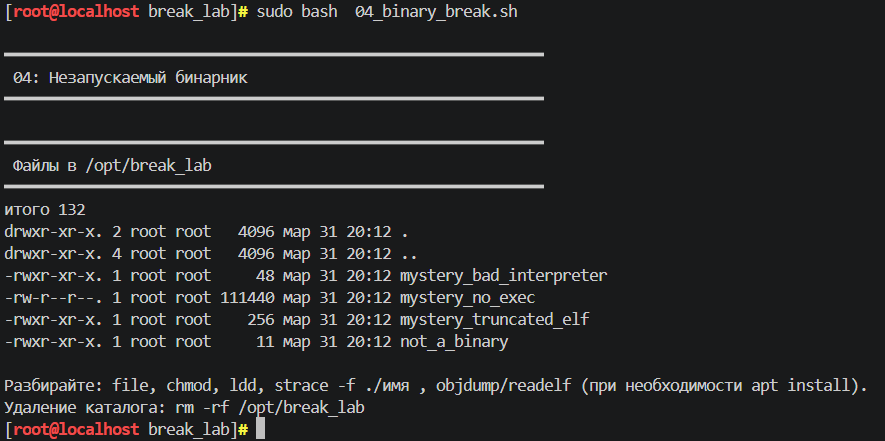
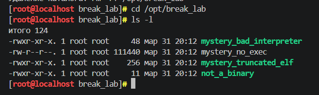
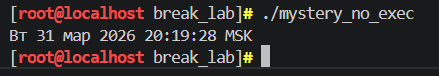
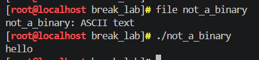
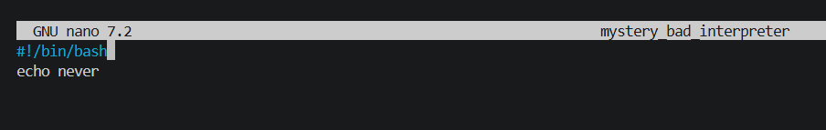
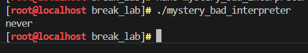
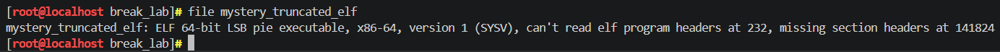
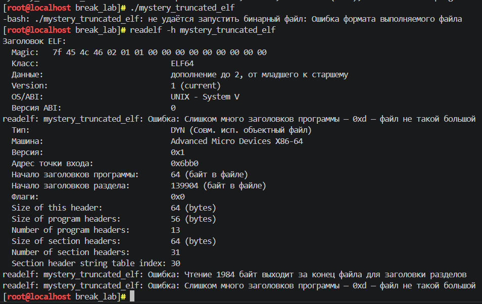
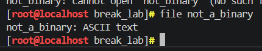

## BREAK лабораторные

## Лаба 4 с использованием скрипта 04_binary_break.sh

---
Как я поняла скрипт 4 нам подкидывает 4 файла в отдельной папке и нам надо понять, почему они не хотят запускаться. А ещё заставить их работать. (скриншот 1)

Смотрю первый. У него прав нет на выполнение, это сразу видно по выводу ls -l (скриншот 2). Ну, быстренько добавляю chmod +x, пробую запустить. Ну и всё, работает, выводит дату какую-то. Легко починилось. (скриншот 3)

Второй файл уже интереснее. Командой file смотрю, а он оказывается вообще не бинарник (о чем можно догодаться и из названия), а просто текст. Там даже слово какое-то написано внутри. Никак его не запустить, потому что это не программа, тут уж ничего не сделаешь плаки плаки  (скриншот 4)

Третий файл из названия подозрительный, что-то с интерпретатором не то. file показывает, что он пытается использовать какой-то несуществующий путь. Захожу внутрь, смотрю первую строчку ,а там действительно указана фигня какая-то, которой нет в системе. Поправила на /bin/bash (скриншот 6), после этого запускается и что-то выводит. Работает. (скриншот 7)

Последний файл для меня был самый не понятый ну или я тупая. file пишет, что это ELF, но ругается на заголовки. Запускаю , а ошибка формата. Через readelf посмотрела, а он говорит, что файл слишком маленький для того, чтобы в нем поместилось столько заголовков. Короче, файл полностью поврежден (скриншот 8)

В итоге из четырех три файла как-то починила, один так и остался нерабочим, потому что он сломан на уровне структуры.

## Результаты выполнения

**Запуск скрипта 4:**

**Список бинарников:**

**Вывод после починки:**

**Файл с хелло**

**Исправление файла:**

**Исполнение:**

**Ошибки странного файла:**

