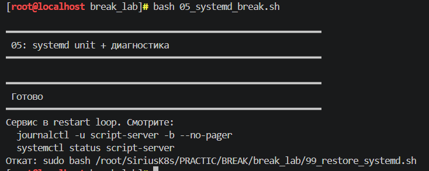
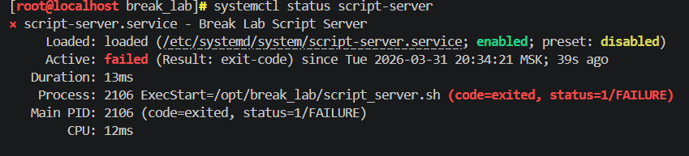
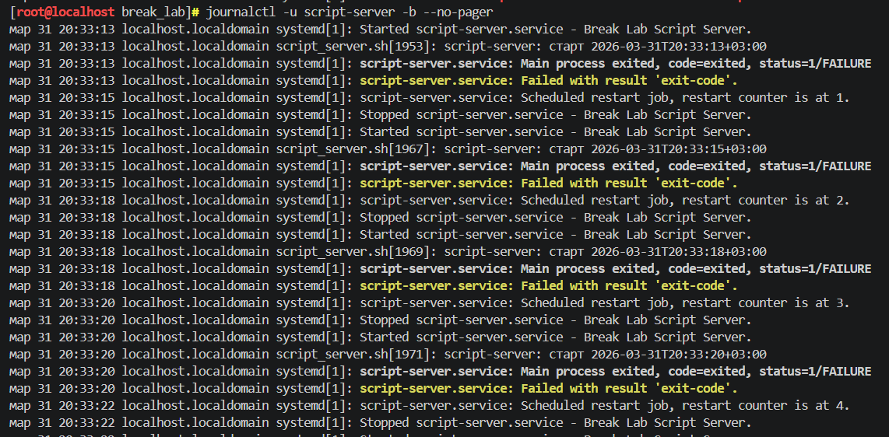
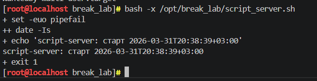
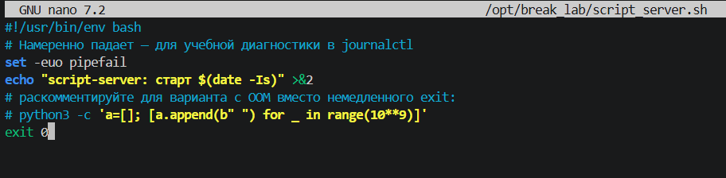
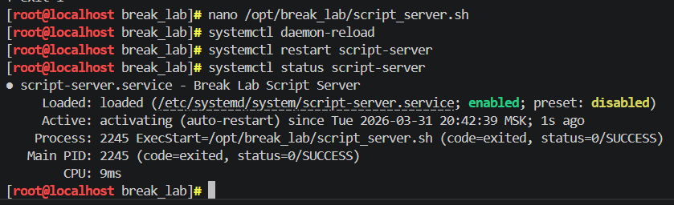

## BREAK лабораторные

## Лаба 5 с использованием скрипта 05_systemd_break.sh

---
5 лабораторная работа это диагностика сломанного systemd-сервиса. После запуска скрипта я увидела, что сервис script-server пытается стартовать, но сразу же останавливается (скриншот 1)

Первым делом я проверила статус командой systemctl status script-server. В выводе было написано, что процесс завершился с ошибкой (code=exited, status=1/FAILURE). код выхода 1 означает, что что-то пошло не так. (скриншот 2)

Дальше я посмотрела логи через journalctl -u script-server. Там было видно, что сервис бесконечно перезапускается: стартует, падает, через пару секунд снова стартует. В логах тоже мелькал этот код ошибки, и была указана команда, которая запускается /opt/break_lab/script_server.sh. (скриншот 3)

Я открыла этот файл и посмотрела, что внутри. Оказалось, это bash-скрипт. В нем стояла опция set -e, которая заставляет скрипт завершаться при любой ошибке, а в конце был написан exit 1. Это означало, что скрипт специально завершался с кодом ошибки, из-за чего systemd считал, что сервис упал. (скриншот 4)

Я изменила exit 1 на exit 0, чтобы скрипт завершался успешно.(скриншот 5) После этого перезагрузила конфигурацию systemd и перезапустила сервис. Проверила статус, теперь он был активен и не падал (скриншот 6)

## Результаты выполнения

**запуск скрипта 5:**

**Проверка, что не запускается:**

**Логи:**

**Скрипт**

**Изменила exit:**

**Проверка:**

