### ЛАБОРАТОРНАЯ РАБОТА SRE Practical Workshop

**0. Подготовка**

Работа выполняла на виртуальной машине с установленной ОС - РедОс сервер минимальный.
В процессе запуска контейнеров возникло две ошибки. Первая была связана с несоответствием go.sum, проблема решилась удалением файла и пересборкой (скриншот 1) 

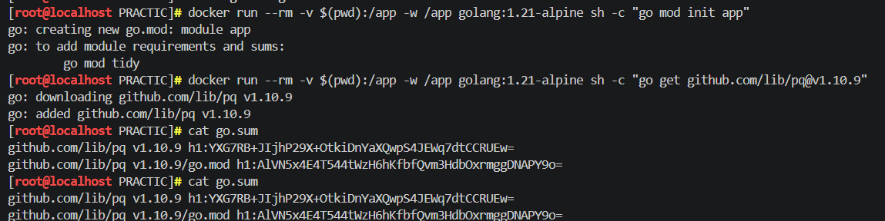

Вторая ошибка заключалась в наличии неиспользуемого импорта "os" в main.go, который был удалён. После этих исправлений контейнеры успешно запустились (скриншот 2)

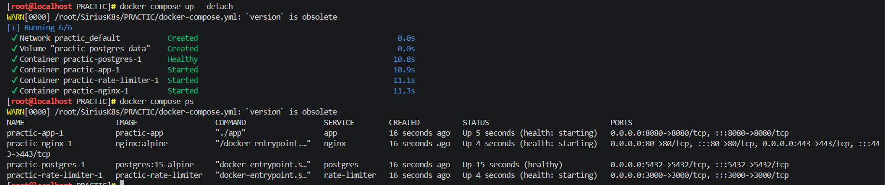

**1. Урок первый: Тестирование Nginx**

Был выполнен запрос curl http://localhost:8080/health, который вернул JSON-ответ со статусом healthy и временной меткой. (Скриншот 1-2)

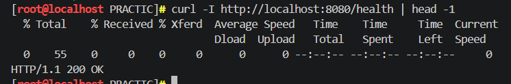
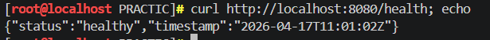

Это подтвердило, что Nginx работает как Reverse Proxy и корректно проксирует запросы к бэкенд-приложению. Nginx запущен и слушает порт 8080, health check работает, приложение отвечает JSON-ответом.

/////////////////////////////////////////////////////////////////////////

Логи контейнера practic-nginx-1 показали, что Nginx успешно прошёл все этапы настройки и готов принимать соединения. После завершения проверки контейнеры были остановлены командой docker-compose down. 

При попытке обратиться к эндпоинту /api/v1/status выяснилось, что такого маршрута нет , а в коде main.go прописан только /api/status. При сравнении двух запросов с заголовком X-User-ID и без него ответы оказались одинаковыми, поскольку сервер не настроен на чтение этого заголовка. HTTP-заголовок X-User-ID передаёт дополнительную информацию, но его обработка зависит от логики приложения. Без соответствующей реализации в коде заголовок игнорируется. (Скриншот 3)

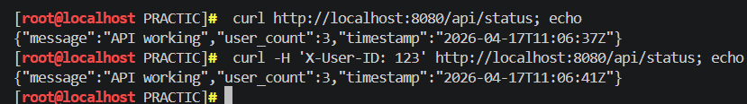

С помощью команды curl -w 'Time: %{time_total}s' было измерено общее время выполнения HTTP-запроса, что позволяет оценить производительность API. (Скриншот 4)

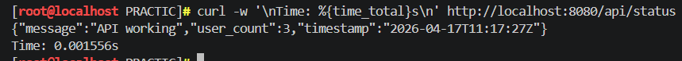

/////////////////////////////////////////////////////////////////////////

Скрипт test-api-working.sh изначально не запускался из-за наличия в нём инструкции set -e, которая прерывала выполнение при любой ошибке. В частности, команда (( test_count++ )) интерпретировалась как ошибка. После комментирования этой строки скрипт успешно выполнился. В процессе тестирования обнаружилось несоответствие в названии поля: скрипт ожидал users_count, а приложение возвращало user_count. Ошибка была исправлена с помощью sed, после чего все тесты успешно прошли. Приложение продемонстрировало корректную работу health checks, API функциональность, высокую производительность (менее 1 мс), правильную обработку ошибок, поддержку HTTP заголовков, базовые меры безопасности и совместимость с прокси. (Скриншот 5)

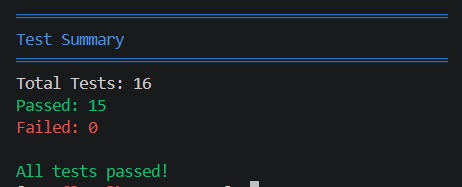

**2. Урок второй: Docker (безопасность) и Multi-stage**

В уроке по безопасности требовалось запустить скрипт check-docker-security.sh и добиться зелёных галочек для всех проверок: capabilities, отсутствие root пользователя, отключённый привилегированный режим, права на файловую систему и режим сети. 
После запуска скрипта выяснилось, что все контейнеры работают от root, что является критической проблемой. 

Чтобы это исправить, добавила в Dockerfile.app создание пользователя appuser и переключение на него, в Dockerfile.middleware добавила пользователя nodeuser, а для postgres просто указала user: postgres в docker-compose.yml. (Скриншот 1-3)

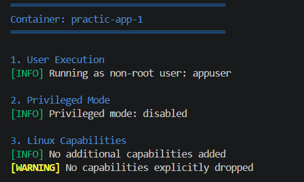
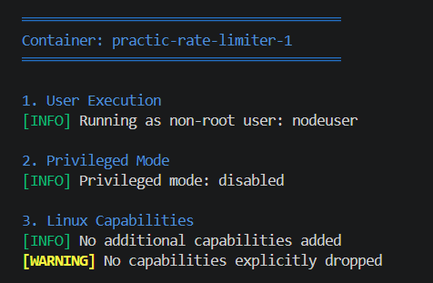
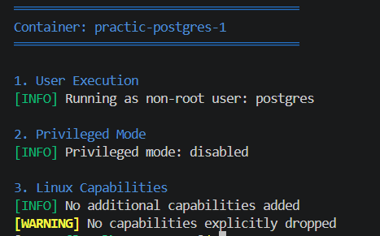

Самой сложной оказалась настройка Nginx.  
Когда мы упаковываем его в изолированный контейнер и лишаем прав root ради безопасности, он начинает "капризничать", потому что привычные ему пути для записи логов и временных файлов оказываются заблокированы. Поэтому пришлось вручную перенастраивать его внутренние маршруты на временные папки, чтобы он мог выполнять свою работу, оставаясь при этом максимально бесправным и безопасным для всей остальной системы.Не уверена насколько это корректно, но свою задачу в этой лабораторной он выполнил. (Скриншот 4)

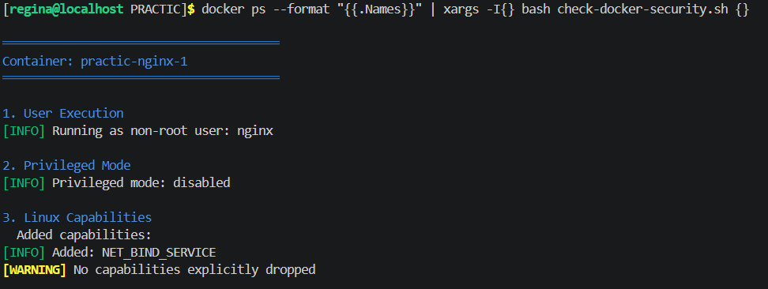

/////////////////////////////////////////////////////////////////////////

Далее создали обычный Dockerfile.regular, который собирает образ на основе полного образа golang:1.21-alpine со всеми инструментами разработки. Этот образ получился размером 308 мегабайт. После этого восстановили оригинальный multi-stage Dockerfile.app. Этот multi-stage образ занял всего 34.5 мегабайта, что почти в девять раз меньше обычного. Разница возникает потому, что в финальный образ попадает только скомпилированный бинарник и минимальное окружение, а Go компилятор, исходный код и все инструменты сборки остаются в промежуточном этапе. (Скриншот 5)

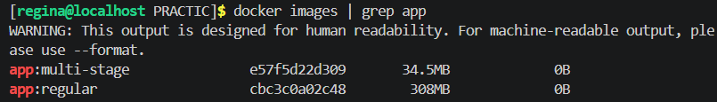

**3. Урок третий: Rate Limiting (Token Bucket)**

В уроке по rate limiting требовалось проверить работу алгоритма Token Bucket и получить статистику. Изначально скрипт test-rate-limiting.sh отправлял запросы на http://localhost/api/status, но rate-limiter слушает на порту 3000, поэтому все запросы получали HTTP 000. 
Проблема решилась исправлением переменной ENDPOINT на http://localhost:3000, (Скриншот 1) 

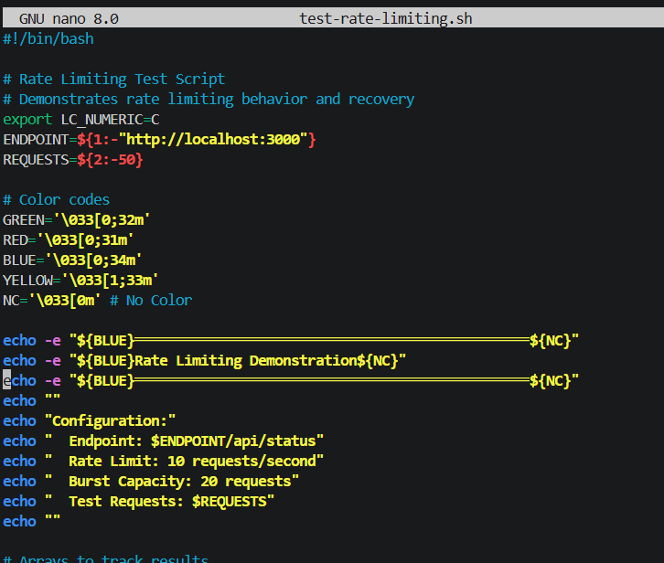

Recovery test показал, что после паузы в 3 секунды все 10 запросов получили HTTP 200, что подтверждает восстановление токенов. (Скриншот 1)

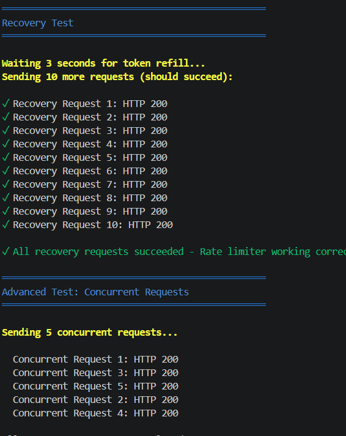

/////////////////////////////////////////////////////////////////////////

Для проверки были созданы скрипты test-burst.sh (100 запросов), test-recovery.sh и test-ip.sh. В результате тестов: при 100 запросах 25 получили 200, 75 — 429;(Скриншот 4)

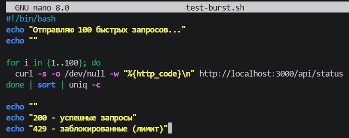
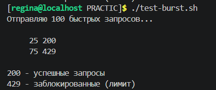

 В результате тестов: при 100 запросах 25 получили 200, 75 — 429; после паузы все запросы восстановились; разные IP-адреса получили независимые лимиты. (Скриншот 5-6)

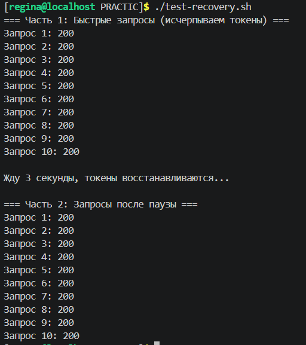
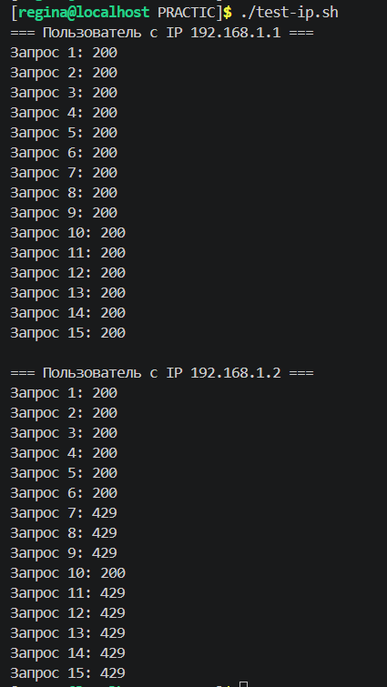

 Изначально приложение не выводило подробности в консоль, и счётчик токенов был не виден. После добавления в код Node.js вывода в stdout теперь в логах отображается точное количество токенов. Скрипт test-logs.sh успешно находит 26 записей о rate limiting в логах контейнера. (Скриншот 7)
 
 

**4. Урок четвертый: Логирование и Observability, анализ логов**

В уроке по логированию и observability требовалось настроить структурированное логирование в JSON формате с двойной записью в файл и PostgreSQL, а также освоить анализ логов через SQL. Сначала проверила наличие таблицы для логов и обнаружила, что она существует, но не в JSON формате, поэтому создала новую таблицу requests_logs с колонкой log_data типа JSONB. (Скриншот 1-2)

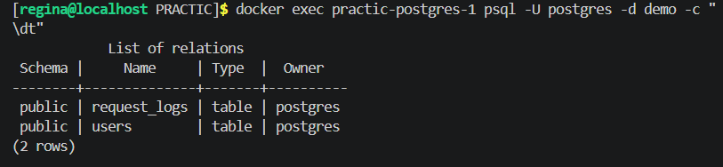
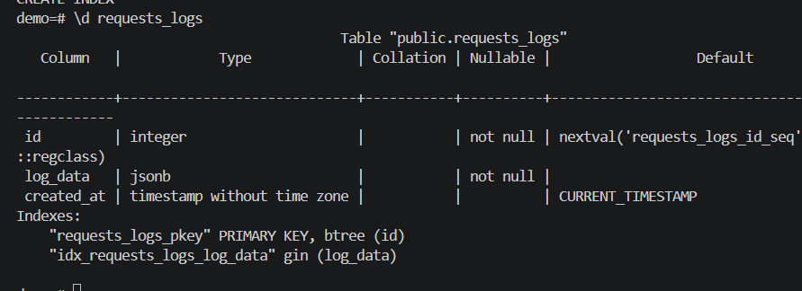

Был создан SQL-скрипт insert_test_logs.sql, который вставил десять тестовых записей с разными HTTP-методами, статусами ответов (200, 201, 204, 400, 401, 404, 429, 500), уровнями логирования и IP-адресами. После выполнения скрипта команда SELECT вывела все десять записей с полями id, log_data в JSON и created_at. (Скриншот 3)

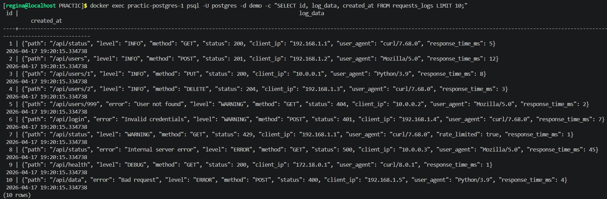

Также научилась выводить только JSON данные без id и created_at, а также экспортировать логи из базы данных в файл. (Скриншот 4-5)

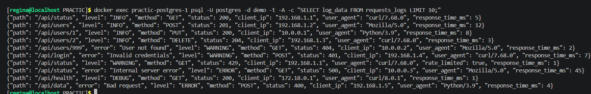
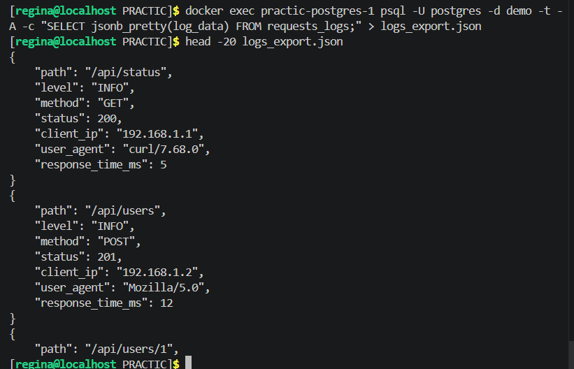

/////////////////////////////////////////////////////////////////////////

Для проверки файлового логирования использовала команду tail -f logs/app.log, которая показывает логи в реальном времени по мере генерации тестовых логов Python-скриптом generate_logs.py. (Скриншот 6)

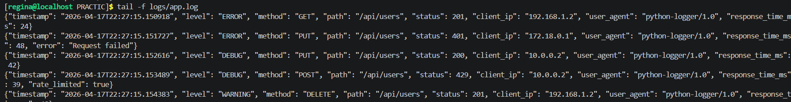

Команда cat logs/app.log | jq '.' преобразует каждую JSON-строку в удобочитаемый формат с отступами, что делает логи наглядными для анализа. (Скриншот 7)

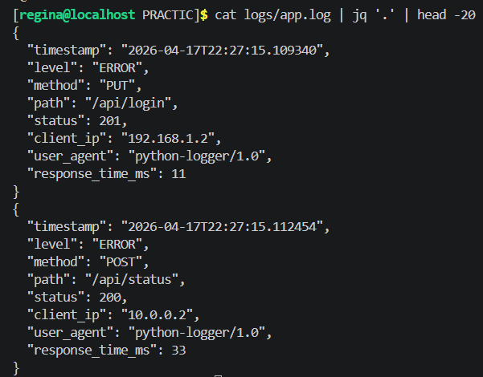

Запрос SELECT * FROM requests_logs LIMIT 10 подтвердил, что в базе данных хранятся десять тестовых логов в JSON формате. (Скриншот 8)

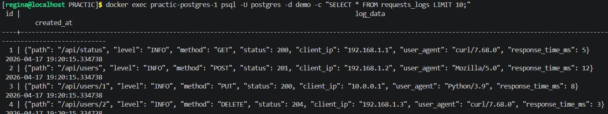

Статистика по статус-кодам показала, что чаще всего встречаются статусы 404 (11 раз), 401 и 201 (по 10 раз), а временной ряд из последних 20 записей позволяет отслеживать хронологию событий и выявлять аномалии. (Скриншот 10)

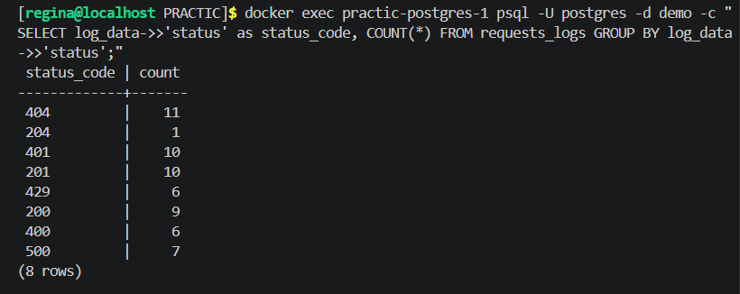

Все тестовые команды успешно выполнены, что подтверждает корректную работу структурированного логирования с одновременной записью в файл и базу данных PostgreSQL.

**5. Урок пятый: Отладка и Network Debugging**
 
В уроке по отладке и network debugging требовалось освоить инструменты tcpdump и strace, а также разобрать сценарии диагностики проблем. (Скриншот 1)

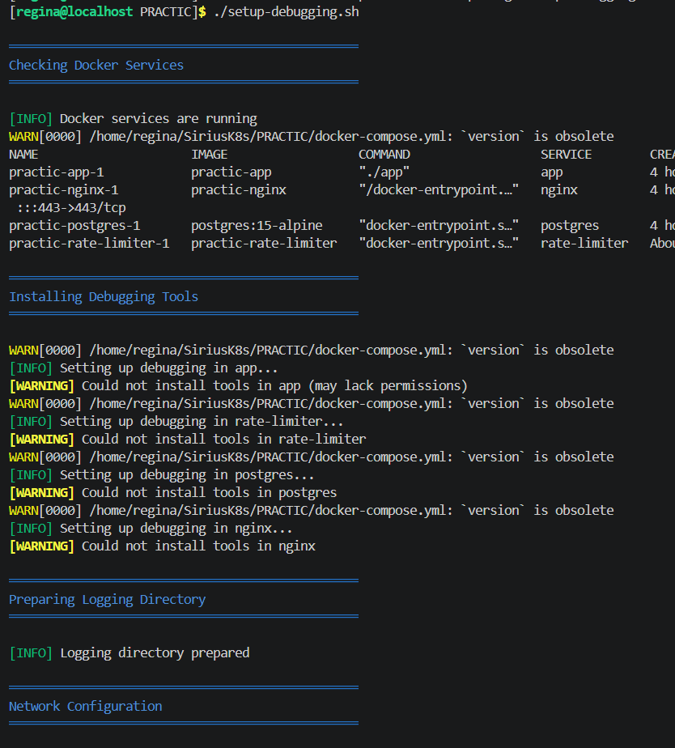

Для захвата трафика использовала tcpdump на интерфейсе ens160. В выводе видно, как происходит обмен данными между виртуальной машиной и клиентом по протоколу TCP на порту 22 (SSH-соединение). В пакетах присутствуют флаги PSH и ACK, что означает передачу данных и подтверждение получения. Это демонстрирует, что tcpdump позволяет перехватывать и анализировать сетевой трафик в реальном времени. (Скриншот 2)

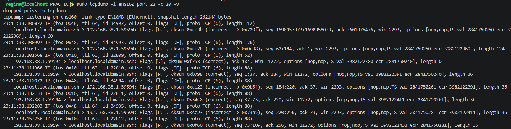

Команда strace выполнила трассировку сетевых системных вызовов curl. В выводе видно, как curl создаёт сокет через socket, устанавливает параметры через setsockopt, подключается к порту 8080 через connect, отправляет HTTP GET запрос через sendto и получает ответ через recvfrom. (Скриншот 3)

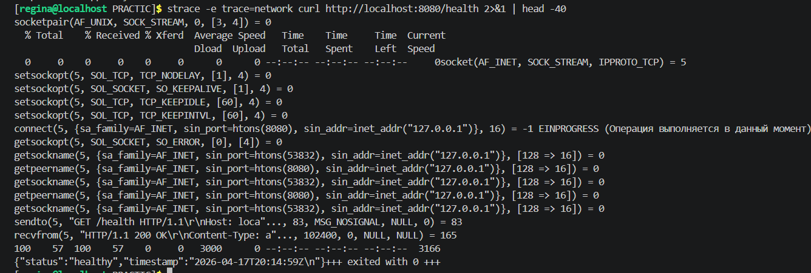

Полный трассинг запроса показывает каждое действие curl на уровне ядра: загрузку программы (execve), выделение памяти (brk, mmap), открытие библиотек (openat, read) и проверку файлов (access, newfstatat).(Скриншот 4)

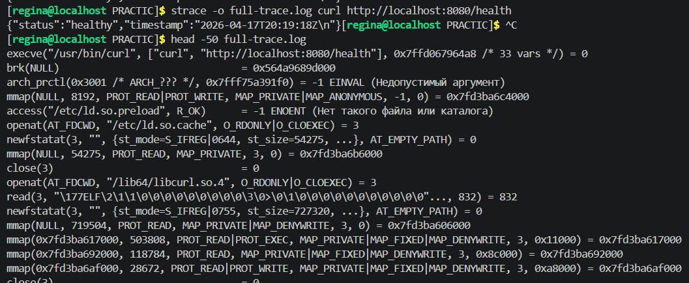

/////////////////////////////////////////////////////////////////////////

В первом сценарии проверяется поведение системы при отсутствии сети. Чтобы смоделировать эту ситуацию, можно заблокировать порт с помощью iptables, после чего tcpdump покажет попытки соединения, но ответа от сервера не последует, что позволяет диагностировать проблемы с доступностью.

Второй сценарий имитирует перегруженное приложение, когда оно начинает работать с задержками. Для этого достаточно отправить много параллельных запросов с помощью цикла в фоновом режиме, а затем наблюдать за логами контейнера, где будет видно, как время обработки запросов увеличивается.

Третий сценарий демонстрирует анализ плохо сформированного запроса с помощью strace. Если отправить curl на несуществующий эндпоинт, strace покажет все системные вызовы, включая connect и recvfrom, и в конце можно увидеть HTTP-ответ 404, что помогает понять, где именно возникает ошибка.

Четвёртый сценарий посвящён измерению высокой задержки. С помощью опции -w в curl можно измерить время на DNS-разрешение, установку соединения, время до первого байта и общее время ответа, что позволяет выявить узкие места в производительности сети и сервера.